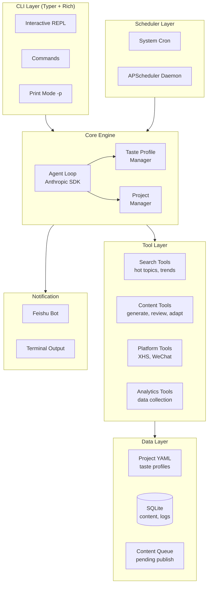
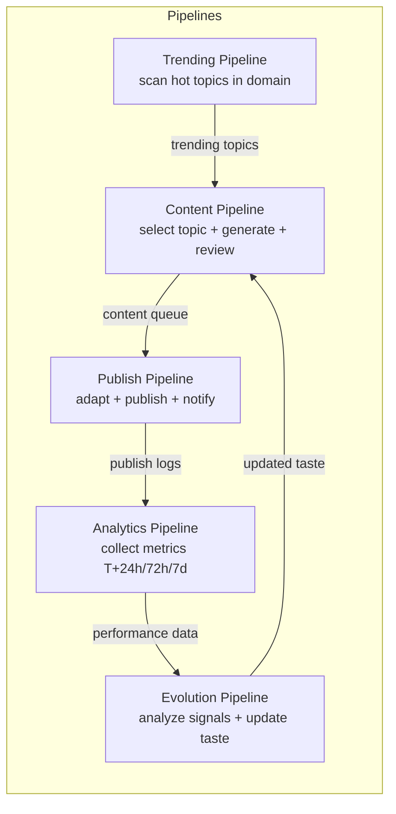
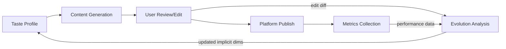
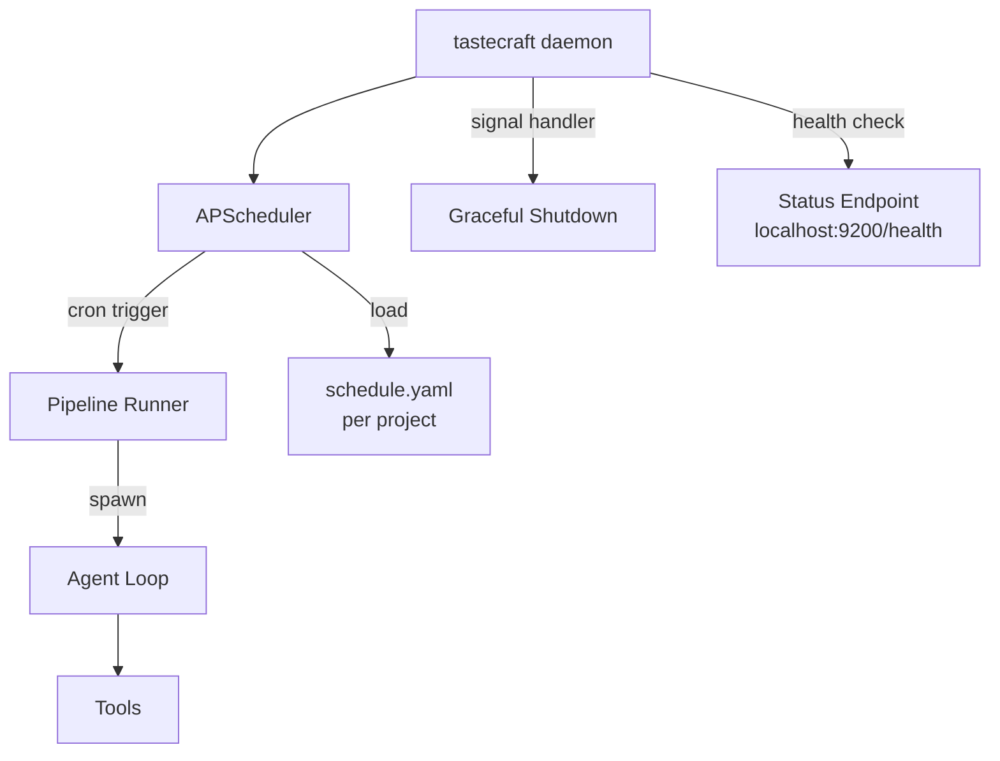
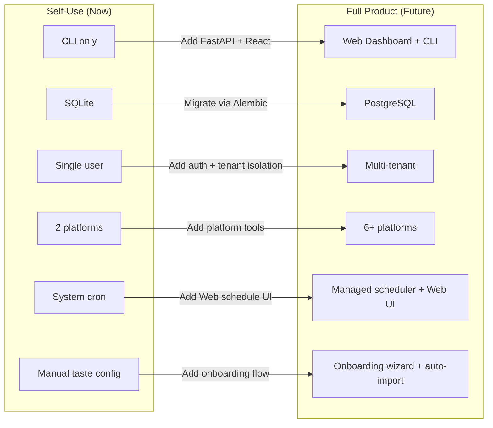

# TasteCraft Self-Use Edition — PRD v1.0

> CLI-first AI content engine for personal multi-platform publishing

**Version**: 1.0
**Date**: 2026-04-05
**Status**: DRAFT

---

## 1. Overview

### 1.1 One-liner

TasteCraft Self-Use Edition is a CLI-driven AI content engine that auto-generates, reviews, and publishes content to Xiaohongshu and WeChat Official Account, with per-project taste isolation and cron-based scheduling.

### 1.2 Self-Use vs Full Product

| Dimension | Self-Use (this PRD) | Full Product (v2 PRD) |
|-----------|--------------------|-----------------------|
| Users | Single user (you) | Multi-tenant SaaS |
| Interface | CLI (Typer + Rich) | Web Dashboard + CLI |
| Platforms | Xiaohongshu + WeChat | 6+ platforms |
| Onboarding | Manual config YAML | Guided wizard + import |
| User mgmt | None | Auth, roles, billing |
| Taste engine | Per-project YAML + evolution log | Full TEE with A/B testing |
| Scheduling | System cron + APScheduler | APScheduler + Web UI |
| Content modes | Mode A (auto) + Mode B (collab) | A + B + C (video scripts) |
| Database | SQLite | PostgreSQL |

### 1.3 Design Principles

1. **System-driven, not user-driven** — Core is cron daemon, not request-response
2. **Single Agent + Multi Tool** — One Claude agent loop per pipeline run, no CrewAI
3. **Stateless Agent Loop** — Each run starts fresh; taste profile injected via system prompt
4. **Project isolation** — Multiple content lines with independent taste profiles and memory
5. **CLI-first** — Inspired by Claude Code interaction patterns (REPL + print mode)
6. **Anthropic SDK native** — Direct SDK usage, no framework lock-in

---

## 2. Core Concepts

### 2.1 Project

A Project represents an independent content line with its own taste profile, content history, and publishing config.

Examples:
- `ai-startup` — AI/tech content for personal brand
- `food-review` — Restaurant and cooking content
- `reading-notes` — Book reviews and reading insights

Each project has:
- Isolated taste profile (style, tone, taboos, preferences)
- Independent content queue and publish history
- Separate evolution log and analytics
- Per-project platform accounts and scheduling

Storage layout:
```
~/.tastecraft/
  config.yaml              # Global config (API keys, defaults)
  projects/
    ai-startup/
      taste.yaml           # Taste profile (explicit dimensions)
      taste_learned.json   # Implicit dimensions (system-learned)
      evolution.log        # Evolution history (JSONL)
      schedule.yaml        # Cron schedule config
    food-review/
      taste.yaml
      taste_learned.json
      evolution.log
      schedule.yaml
  data/
    tastecraft.db          # SQLite (content, publish logs, analytics)
```

### 2.2 Taste Profile

Structured representation of content style preferences.

**Explicit dimensions** (user-configured in `taste.yaml`):

| Dimension | Description | Example |
|-----------|-------------|---------|
| identity | Who you are, what you do | "AI product founder, focus on efficiency tools" |
| tone | Overall style | "Professional but approachable, occasionally sharp" |
| audience | Who reads your content | "25-35 tech workers" |
| benchmarks | Favorite accounts (up to 3) | ["sspai", "huxiu", "lanxi"] |
| taboos | Forbidden words/topics | ["empower", "chicken soup", "excessive emoji"] |
| catchphrases | Signature expressions | ["Talk like a human", "Cut the BS"] |
| content_goal | Desired reader reaction | "Learn something + want to share" |

Example `taste.yaml`:
```yaml
project: ai-startup
identity: "AI product founder, building efficiency tools for creators"
tone: "Professional but approachable. Data-driven. Occasionally sharp and contrarian."
audience: "25-35 tech workers interested in AI and productivity"
benchmarks:
  - "sspai"
  - "huxiu"
  - "lanxi"
taboos:
  - words: ["empower", "synergy", "leverage", "ecosystem"]
  - topics: ["chicken soup", "motivational quotes"]
  - style: ["excessive emoji", "clickbait titles"]
catchphrases:
  - "Talk like a human"
  - "Show me the data"
content_goal: "Reader learns something concrete and wants to share"
platforms:
  xiaohongshu:
    account_id: "xhs_xxx"
    max_images: 9
    style_override: "More casual, more emoji than default"
  wechat:
    app_id: "wx_xxx"
    style_override: "Longer form, more structured"
```

**Implicit dimensions** (system-learned, stored in `taste_learned.json`):

| Dimension | Learning Source | Update Frequency |
|-----------|---------------|-----------------|
| Best title patterns | Platform data (high CTR titles) | Weekly |
| Best opening styles | Platform data + user edits | Weekly |
| Optimal content length | Platform data (read completion) | Monthly |
| Emoji density | User edit patterns | Per generation |
| Hashtag strategy | Platform data (exposure) | Weekly |
| Paragraph rhythm | User edit patterns | Per generation |

### 2.3 Agent Loop

Core execution unit. Each pipeline run spawns a fresh agent loop:

```python
async def agent_loop(
    system_prompt: str,
    tools: list[Tool],
    initial_message: str,
    max_turns: int = 20,
) -> AgentResult:
    """
    Core agent loop. Spawned fresh for each pipeline run.
    Stateless: taste profile injected via system_prompt.
    """
    client = AsyncAnthropic()
    messages = [{"role": "user", "content": initial_message}]
    tool_schemas = [t.to_anthropic_schema() for t in tools]

    for turn in range(max_turns):
        response = await client.messages.create(
            model="claude-sonnet-4-20250514",
            max_tokens=8192,
            system=system_prompt,
            messages=messages,
            tools=tool_schemas,
        )
        messages.append({"role": "assistant", "content": response.content})
        tool_uses = [b for b in response.content if b.type == "tool_use"]

        if not tool_uses:
            return AgentResult(
                success=True,
                output="".join(b.text for b in response.content if b.type == "text"),
                turns=turn + 1,
            )

        tool_results = []
        for tu in tool_uses:
            tool = find_tool(tools, tu.name)
            result = await tool.execute(**tu.input)
            tool_results.append({
                "type": "tool_result",
                "tool_use_id": tu.id,
                "content": str(result),
            })
        messages.append({"role": "user", "content": tool_results})

    return AgentResult(success=False, output="Max turns reached", turns=max_turns)
```

---

## 3. System Architecture

### 3.1 Architecture Overview



### 3.2 Component Responsibilities

| Component | Responsibility |
|-----------|---------------|
| **CLI** | User interaction: project management, manual content generation, review, config |
| **Scheduler** | Cron-triggered pipeline execution (content, publish, analytics, evolution) |
| **Agent Loop** | Single Claude API conversation with tool use; one loop per pipeline run |
| **Taste Profile Manager** | Load/save/merge taste profiles; build system prompt from profile |
| **Project Manager** | CRUD projects; ensure isolation between content lines |
| **Search Tools** | Hot topic discovery, trend analysis, competitor content scanning |
| **Content Tools** | Content generation, quality review, platform adaptation |
| **Platform Tools** | Authenticate and publish to Xiaohongshu / WeChat; collect analytics |
| **Analytics Tools** | Collect post-publish metrics (views, likes, comments, shares) |
| **SQLite DB** | Persist content drafts, publish logs, analytics data, evolution history |
| **Notification** | Send Feishu messages for publish results, weekly reports, errors |

### 3.3 Pipeline Architecture

Five pipelines, each spawning an independent agent loop:



Each pipeline:
1. Loads project config and taste profile
2. Builds a pipeline-specific system prompt
3. Spawns an agent loop with relevant tools
4. Agent autonomously executes using tool calls
5. Results persisted to SQLite
6. Notifications sent on completion/failure

---

## 4. Data Model

### 4.1 ER Diagram

```mermaid
erDiagram
    PROJECT ||--o{ CONTENT : produces
    PROJECT ||--o{ SCHEDULE_RULE : has
    PROJECT ||--|| TASTE_PROFILE : has
    CONTENT ||--o{ PUBLISH_LOG : "published to"
    CONTENT ||--o{ CONTENT_REVISION : "revised as"
    PUBLISH_LOG ||--o{ ANALYTICS_SNAPSHOT : "metrics at"
    PROJECT ||--o{ EVOLUTION_LOG : "evolves via"

    PROJECT {
        string id PK "slug: ai-startup"
        string name "display name"
        string description
        json platforms "enabled platforms + config"
        string status "active | paused | archived"
        datetime created_at
        datetime updated_at
    }

    TASTE_PROFILE {
        string project_id PK FK
        json explicit "user-configured dimensions"
        json implicit "system-learned dimensions"
        float confidence "overall profile confidence 0-1"
        int generation_count "total contents generated"
        datetime last_evolved_at
    }

    CONTENT {
        int id PK
        string project_id FK
        string pipeline_run_id "trace back to pipeline execution"
        string title
        text body
        json metadata "hashtags, images, seo_keywords"
        string mode "auto | collab"
        string status "draft | queued | published | failed | archived"
        float quality_score "0-10 from review agent"
        json review_feedback "structured review result"
        datetime created_at
    }

    CONTENT_REVISION {
        int id PK
        int content_id FK
        text body_before
        text body_after
        text diff "unified diff"
        string revision_source "user_edit | agent_review | evolution"
        json learned_signals "extracted taste signals from diff"
        datetime created_at
    }

    PUBLISH_LOG {
        int id PK
        int content_id FK
        string platform "xiaohongshu | wechat"
        string platform_post_id "post ID on platform"
        string platform_url "published URL"
        string status "success | failed | pending"
        json adapted_content "platform-specific version"
        text error_message
        datetime published_at
    }

    ANALYTICS_SNAPSHOT {
        int id PK
        int publish_log_id FK
        string snapshot_type "T+24h | T+72h | T+7d"
        int views
        int likes
        int comments
        int shares
        int saves
        int new_followers
        float engagement_rate "interactions / views"
        json raw_data "full platform response"
        datetime collected_at
    }

    EVOLUTION_LOG {
        int id PK
        string project_id FK
        string trigger "immediate | weekly | monthly"
        json signals_input "all signals considered"
        json changes_made "dimensions changed and how"
        json taste_before "snapshot before evolution"
        json taste_after "snapshot after evolution"
        float confidence_delta "change in overall confidence"
        datetime created_at
    }

    SCHEDULE_RULE {
        int id PK
        string project_id FK
        string pipeline "content | publish | analytics | evolution | trending"
        string cron_expr "cron expression"
        bool enabled
        datetime last_run_at
        datetime next_run_at
    }
```

### 4.2 Key Design Decisions

1. **CONTENT_REVISION tracks diffs** — User edits are the most valuable evolution signal. Every edit is stored as a diff with extracted taste signals.
2. **ANALYTICS_SNAPSHOT is time-series** — Collect metrics at T+24h, T+72h, T+7d to understand content lifecycle performance.
3. **EVOLUTION_LOG is append-only** — Full audit trail of taste changes. Can roll back to any point in time.
4. **TASTE_PROFILE stores both explicit and implicit** — Explicit from YAML (user-editable), implicit from system learning (JSON blob).
5. **SQLite for simplicity** — Single file, zero config, sufficient for single-user. Upgrade path to PostgreSQL when needed.

---

## 5. CLI Design

### 5.1 Design Philosophy

Inspired by Claude Code's CLI interaction model:
- **Interactive REPL** as default mode — conversational content creation
- **Print mode** (`-p`) for scripting and cron integration
- **Session continuity** — resume previous content generation sessions
- **Rich terminal UI** — progress bars, tables, syntax highlighting via Rich
- **Project context** — all commands operate within a project scope

Implementation: Python with Typer (commands) + Rich (UI) + Prompt Toolkit (REPL).
Future production: Anthropic Python SDK for agent loop, no CrewAI dependency.

### 5.2 Command Structure

```
tastecraft [global-options] <command> [command-options]

Global Options:
  -p, --project <name>     Target project (default: from .tastecraft/current)
  --print                  Non-interactive output (for cron/pipes)
  --verbose / -v           Verbose logging
  --dry-run                Simulate without publishing
  --config <path>          Override config file

Commands:
  project                  Manage projects
  generate                 Generate content (interactive or auto)
  review                   Review and edit content
  publish                  Publish content to platforms
  schedule                 Manage cron schedules
  analytics                View content performance
  taste                    View/edit taste profile
  evolve                   Trigger taste evolution
  trending                 Scan trending topics
  queue                    Manage content queue
  run                      Run a full pipeline
  daemon                   Start scheduler daemon
```

### 5.3 Command Details

#### `tastecraft project`

```bash
# Create a new project (interactive wizard)
tastecraft project create

# Create with inline options
tastecraft project create ai-startup \
  --identity "AI product founder" \
  --tone "Professional but sharp" \
  --platforms xiaohongshu,wechat

# List all projects
tastecraft project list

# Switch active project
tastecraft project use ai-startup

# Show project status (content count, last publish, taste confidence)
tastecraft project status

# Edit taste profile in editor
tastecraft project edit-taste

# Archive a project
tastecraft project archive food-review
```

#### `tastecraft generate`

```bash
# Interactive mode (default) — REPL conversation with agent
tastecraft generate
# > Agent suggests topics based on trending + taste profile
# > User picks/modifies topic
# > Agent generates draft
# > User reviews inline, requests changes
# > Final draft queued for publish

# Auto mode — fully autonomous, for cron
tastecraft generate --print --mode auto
# Agent picks topic, generates, self-reviews, queues. No interaction.

# With specific topic
tastecraft generate --topic "Why AI agents will replace SaaS"

# Collab mode — agent generates framework, leaves slots for user
tastecraft generate --mode collab

# Resume previous session
tastecraft generate --continue
tastecraft generate --resume <session-id>
```

#### `tastecraft review`

```bash
# Review latest draft interactively
tastecraft review

# Review specific content
tastecraft review --id 42

# List all drafts pending review
tastecraft review list

# Auto-review (agent reviews, no user interaction)
tastecraft review --print --auto
```

#### `tastecraft publish`

```bash
# Publish next queued content
tastecraft publish

# Publish specific content to specific platform
tastecraft publish --id 42 --platform xiaohongshu

# Publish all queued content (for cron)
tastecraft publish --print --all

# Dry run (show what would be published)
tastecraft publish --dry-run
```

#### `tastecraft schedule`

```bash
# Show current schedule
tastecraft schedule list

# Edit schedule interactively
tastecraft schedule edit

# Enable/disable a schedule rule
tastecraft schedule enable content-pipeline
tastecraft schedule disable evolution-pipeline

# Run a specific pipeline now
tastecraft run content
tastecraft run publish
tastecraft run analytics
tastecraft run evolution
tastecraft run trending
```

#### `tastecraft daemon`

```bash
# Start the scheduler daemon (foreground)
tastecraft daemon start

# Start as background process
tastecraft daemon start --background

# Check daemon status
tastecraft daemon status

# Stop daemon
tastecraft daemon stop
```

#### `tastecraft analytics`

```bash
# Show performance summary for active project
tastecraft analytics

# Show specific content performance
tastecraft analytics --id 42

# Weekly report
tastecraft analytics weekly

# Export to CSV
tastecraft analytics export --format csv --output report.csv
```

#### `tastecraft taste`

```bash
# Show current taste profile
tastecraft taste show

# Show evolution history
tastecraft taste history

# Diff between two evolution points
tastecraft taste diff --from 2026-03-01 --to 2026-04-01

# Reset implicit dimensions (keep explicit)
tastecraft taste reset-learned

# Import taste from existing content
tastecraft taste import --file my-articles.txt
```

### 5.4 Interactive REPL Mode

When running `tastecraft generate` without `--print`, enters an interactive REPL:

```
$ tastecraft generate -p ai-startup

  TasteCraft v1.0 | Project: ai-startup | Taste confidence: 72%

  Based on trending topics and your taste profile, here are 3 topic suggestions:

  1. Why AI agents will kill traditional SaaS (trending score: 8.2)
  2. I built an AI content engine in 2 weeks — here's what I learned (personal story)
  3. The real cost of running AI in production (data-driven)

  Pick a number, type your own topic, or press Enter for #1:

> 1

  Generating draft for "Why AI agents will kill traditional SaaS"...

  ━━━━━━━━━━━━━━━━━━━━━━━━━━━━━━━━━━━━━━━━ 100%

  Draft generated (quality score: 7.8/10). Preview:

  ┌─────────────────────────────────────────────────┐
  │ Title: ...                                       │
  │ Body: [first 200 chars]...                       │
  │ Hashtags: #AI #SaaS #ProductHunt                 │
  │ Images: 3 suggested (need generation/upload)     │
  └─────────────────────────────────────────────────┘

  [e]dit | [a]ccept & queue | [r]egenerate | [q]uit:

> e
  Opening in editor...
```

### 5.5 Cron Integration

The `--print` flag makes all commands non-interactive for cron usage:

```bash
# Example crontab entries
# Content generation: daily at 09:00
0 9 * * * tastecraft run content -p ai-startup --print >> ~/.tastecraft/logs/content.log 2>&1

# Publish: 12:00, 18:00, 21:00
0 12 * * * tastecraft run publish -p ai-startup --print >> ~/.tastecraft/logs/publish.log 2>&1
0 18 * * * tastecraft run publish -p ai-startup --print >> ~/.tastecraft/logs/publish.log 2>&1
0 21 * * * tastecraft run publish -p ai-startup --print >> ~/.tastecraft/logs/publish.log 2>&1

# Analytics collection: daily at 23:00
0 23 * * * tastecraft run analytics -p ai-startup --print >> ~/.tastecraft/logs/analytics.log 2>&1

# Taste evolution: Sunday 22:00
0 22 * * 0 tastecraft run evolution -p ai-startup --print >> ~/.tastecraft/logs/evolution.log 2>&1

# Trending scan: Monday 09:00
0 9 * * 1 tastecraft run trending -p ai-startup --print >> ~/.tastecraft/logs/trending.log 2>&1
```

Alternative: use `tastecraft daemon` which runs APScheduler internally and manages all schedules from `schedule.yaml`.

---

## 6. Pipeline Detailed Design

### 6.1 Content Pipeline

**Trigger**: Cron daily 09:00 or `tastecraft run content` / `tastecraft generate`

**System Prompt Composition**:
```
[Base role] You are a content creator for {project.identity}.
[Taste profile] {explicit dimensions from taste.yaml}
[Learned patterns] {implicit dimensions from taste_learned.json}
[Platform constraints] {target platform rules}
[Trending context] {recent trending topics from last scan}
[Historical performance] {top 5 performing contents and why}
```

**Tools Available**:
| Tool | Purpose |
|------|---------|
| `search_trending` | Search hot topics in user's domain |
| `search_competitor` | Analyze competitor content |
| `generate_content` | Generate content draft with structured output |
| `review_content` | Self-review against quality checklist |
| `adapt_platform` | Adapt content for specific platform constraints |
| `save_draft` | Save draft to DB with status=draft |
| `queue_content` | Move content to publish queue |
| `read_taste_profile` | Read current taste profile |
| `read_content_history` | Read past content for dedup and style reference |

**Flow**:
```
Input: project_id, mode (auto|collab)

1. Load taste profile + recent trending topics
2. Agent selects topic (considering: trending score, taste fit, dedup vs history)
3. Agent generates draft
4. Agent self-reviews (quality score 0-10)
   - Score >= 7.0: proceed
   - Score 5.0-6.9: revise and re-review (max 2 rounds)
   - Score < 5.0: discard, try different topic
5. Agent adapts for each target platform
6. Save to DB (status=queued)

Output: Content record(s) in DB with status=queued
```

**Mode A (Auto)**: Steps 1-6 fully autonomous. Notification sent on completion.

**Mode B (Collab)**: After step 3, agent identifies slots requiring user input:
- `photo_required` — needs real photos
- `experience_required` — needs personal experience text
- `fact_check` — needs user to verify facts
- `choice_required` — needs user to pick between options

Agent saves draft with slots marked, sends Feishu notification. User fills slots via CLI (`tastecraft review`). Agent integrates user input and continues to step 4.

### 6.2 Publish Pipeline

**Trigger**: Cron at 12:00/18:00/21:00 or `tastecraft run publish`

**Tools Available**:
| Tool | Purpose |
|------|---------|
| `get_queued_content` | Fetch next content from queue |
| `publish_xiaohongshu` | Publish to Xiaohongshu via CDP |
| `publish_wechat` | Publish to WeChat via API |
| `update_publish_log` | Record publish result |
| `send_notification` | Notify via Feishu |

**Flow**:
```
Input: project_id, max_items (default 1 per run)

1. Fetch next queued content (FIFO, respecting min_publish_interval)
2. Check platform rate limits
3. Publish to target platform(s)
   - Xiaohongshu: CDP-based (Playwright)
   - WeChat: Official API (draft -> publish)
4. Record result in PUBLISH_LOG
5. Update content status (published | failed)
6. Send Feishu notification with result + link

Output: PUBLISH_LOG record(s)
```

**Rate Limiting**:
- Xiaohongshu: min 30 min between posts, max 5/day
- WeChat: max 1 article push/day (API limit), unlimited drafts

### 6.3 Analytics Pipeline

**Trigger**: Cron daily 23:00 or `tastecraft run analytics`

**Tools Available**:
| Tool | Purpose |
|------|---------|
| `list_recent_publishes` | Get publishes needing data collection |
| `collect_xiaohongshu_metrics` | Scrape XHS post metrics |
| `collect_wechat_metrics` | Fetch WeChat article metrics via API |
| `save_analytics_snapshot` | Save metrics snapshot |
| `calculate_engagement` | Compute engagement rate |

**Flow**:
```
Input: project_id

1. Find all published content needing data collection:
   - T+24h: published 24h ago, no T+24h snapshot yet
   - T+72h: published 72h ago, no T+72h snapshot yet
   - T+7d: published 7d ago, no T+7d snapshot yet
2. For each, collect metrics from platform
3. Calculate engagement rate
4. Save ANALYTICS_SNAPSHOT
5. If T+7d collection, mark content analytics as complete

Output: ANALYTICS_SNAPSHOT records
```

### 6.4 Evolution Pipeline

**Trigger**: Cron Sunday 22:00 or `tastecraft run evolution`

**Tools Available**:
| Tool | Purpose |
|------|---------|
| `load_taste_profile` | Read current taste profile |
| `load_weekly_signals` | Aggregate this week's signals |
| `load_content_revisions` | Get user edit diffs from this week |
| `load_analytics_data` | Get performance data from this week |
| `analyze_evolution` | Claude analyzes signals and proposes changes |
| `apply_evolution` | Update taste_learned.json |
| `save_evolution_log` | Record evolution in log |

**Flow**:
```
Input: project_id

1. Load current taste profile (explicit + implicit)
2. Aggregate weekly signals:
   a. User edit diffs (CONTENT_REVISION) -> extract style preferences
   b. Performance data (ANALYTICS_SNAPSHOT) -> identify what works
   c. Trending topics consumed vs ignored -> topic preference signal
3. Agent analyzes signals and proposes taste adjustments
4. Apply constraints:
   - Max 3 dimensions changed per evolution
   - Confidence < 0.5 -> mark as "experimental"
   - Never override explicit user settings
5. Update taste_learned.json
6. Save EVOLUTION_LOG with before/after snapshots
7. Send weekly evolution report via Feishu

Output: Updated taste_learned.json, EVOLUTION_LOG record
```

**Evolution Signal Weights**:
| Signal | Weight | Source |
|--------|--------|--------|
| User edits (diff) | 0.4 | CONTENT_REVISION |
| Engagement rate | 0.3 | ANALYTICS_SNAPSHOT |
| Content completion rate | 0.15 | ANALYTICS_SNAPSHOT |
| Trending alignment | 0.15 | Trending Pipeline |

### 6.5 Trending Pipeline

**Trigger**: Cron Monday 09:00 or `tastecraft run trending`

**Tools Available**:
| Tool | Purpose |
|------|---------|
| `search_xiaohongshu_trending` | Scan XHS hot topics in domain |
| `search_wechat_trending` | Scan WeChat hot articles in domain |
| `analyze_viral_patterns` | Extract patterns from top content |
| `save_trending_cache` | Cache trending data for content pipeline |

**Flow**:
```
Input: project_id

1. Search each platform for top content in user's domain (last 7 days)
2. Analyze viral patterns:
   - Common title structures
   - Content formats that perform well
   - Emerging topics and angles
3. Score each topic for taste fit (alignment with user's profile)
4. Cache top 20 trending topics with scores
5. Available for Content Pipeline to reference

Output: Trending cache (JSON) for use by Content Pipeline
```

---

## 7. Taste Evolution Engine (Simplified)

### 7.1 Overview

Self-use version retains the core evolution loop but simplifies implementation:



### 7.2 Evolution Triggers

| Trigger | Frequency | Scope |
|---------|-----------|-------|
| Immediate | Every user edit | Extract signals from diff, update per-generation dims (emoji density, paragraph rhythm) |
| Weekly | Sunday 22:00 | Aggregate all signals, update all implicit dimensions |
| Monthly | Last day of month | Deep analysis, review explicit dimension suggestions |

### 7.3 Signal Processing

**From user edits** (highest value):
```
Generated: "This tool empowers creators to produce content more efficiently."
User edit: "This tool is genuinely useful — I write 3x faster now."

Extracted signals:
  - taboo_word_detected: "empowers" -> add to taboo list
  - style_preference: formal -> casual/conversational
  - specificity_preference: abstract -> concrete numbers
```

**From platform metrics**:
```
Content A (casual tone, list format): engagement 4.2%
Content B (formal tone, essay format): engagement 1.8%

Extracted signals:
  - tone_preference: casual > formal (confidence: 0.7)
  - format_preference: list > essay (confidence: 0.6)
```

### 7.4 Evolution Constraints

1. Max 3 implicit dimensions changed per weekly evolution
2. Changes with confidence < 0.5 are marked "experimental" and A/B tested next cycle
3. Explicit dimensions (from taste.yaml) are never auto-modified — only suggestions logged
4. Full before/after snapshot saved in EVOLUTION_LOG for rollback
5. Monthly evolution may suggest explicit dimension changes, presented to user for approval

### 7.5 Taste Profile as System Prompt

The taste profile is compiled into a system prompt section for the agent loop:

```python
def build_taste_prompt(project_id: str) -> str:
    explicit = load_yaml(f"projects/{project_id}/taste.yaml")
    implicit = load_json(f"projects/{project_id}/taste_learned.json")

    return f"""
## Your Content Identity

You are writing as: {explicit['identity']}
Your tone: {explicit['tone']}
Your audience: {explicit['audience']}

## Style Rules (MUST follow)
Taboo words: {', '.join(explicit['taboos']['words'])}
Taboo topics: {', '.join(explicit['taboos']['topics'])}
Catchphrases to use naturally: {', '.join(explicit['catchphrases'])}
Content goal: {explicit['content_goal']}

## Learned Patterns (follow when applicable)
Best performing title patterns: {implicit.get('title_patterns', 'N/A')}
Optimal content length: {implicit.get('optimal_length', 'N/A')}
Emoji density: {implicit.get('emoji_density', 'moderate')}
Preferred opening style: {implicit.get('opening_style', 'N/A')}
Paragraph rhythm: {implicit.get('paragraph_rhythm', 'N/A')}
"""
```

---

## 8. Platform Integration

### 8.1 Xiaohongshu (Little Red Book)

**Integration method**: CDP (Chrome DevTools Protocol) via Playwright

**Why CDP, not API**: Xiaohongshu has no official content publishing API. CDP simulates real browser interaction.

**Capabilities**:
| Feature | Method | Status |
|---------|--------|--------|
| Publish image-text note | CDP: fill form + upload images + submit | Existing code (614 lines) |
| Collect post metrics | CDP: navigate to post, scrape stats | Existing code |
| Search trending topics | CDP: search page scraping | Existing code |
| Schedule publish | Internal queue + cron trigger | New |

**Content constraints**:
- Title: max 20 chars
- Body: max 1000 chars
- Images: 1-9 required, recommended 3-6
- Hashtags: 3-8 recommended, max 10
- No external links allowed

**Anti-detection measures**:
- Random delays between actions (2-5s)
- Human-like typing simulation
- Session cookie persistence (avoid re-login)
- Max 5 posts/day, min 30 min interval
- Rotate user-agent periodically

**Adaptation rules** (from taste profile to XHS format):
```python
def adapt_for_xiaohongshu(content: Content, taste: TasteProfile) -> XHSContent:
    return XHSContent(
        title=truncate(content.title, 20),
        body=format_xhs_body(
            content.body,
            max_chars=1000,
            emoji_density=taste.implicit.get("xhs_emoji_density", "high"),
            paragraph_style="short",  # XHS prefers short paragraphs
        ),
        hashtags=select_hashtags(content.metadata["hashtags"], max=8),
        images=content.metadata.get("images", []),
    )
```

### 8.2 WeChat Official Account

**Integration method**: Dual-mode
1. **Official API** (primary): WeChat MP API for draft creation and publishing
2. **CDP fallback**: For features not covered by API

**Capabilities**:
| Feature | Method | Status |
|---------|--------|--------|
| Create draft article | API: `draft/add` | Existing code (437 lines) |
| Publish article | API: `freepublish/submit` | Existing code |
| Upload images | API: `media/uploadimg` | Existing code |
| Collect article metrics | API: `datacube/getarticlesummary` | Existing code |
| Search trending | Web scraping (sogou weixin search) | Existing code |

**Content constraints**:
- Title: max 64 chars
- Body: unlimited (but 2000-5000 chars recommended)
- Images: unlimited, inline in body (HTML)
- Supports rich HTML formatting
- 1 push/day limit (API), unlimited drafts

**Adaptation rules**:
```python
def adapt_for_wechat(content: Content, taste: TasteProfile) -> WeChatArticle:
    return WeChatArticle(
        title=truncate(content.title, 64),
        content=format_wechat_html(
            content.body,
            style=taste.implicit.get("wechat_style", "structured"),
            add_author_intro=True,
            add_qr_code_footer=True,
        ),
        thumb_media_id=upload_cover_image(content.metadata.get("cover")),
        digest=generate_digest(content.body, max_chars=120),
    )
```

### 8.3 Platform Tool Interface

Both platform tools implement a common interface:

```python
class PlatformTool(ABC):
    """Base interface for all platform tools."""

    platform_name: str
    max_daily_posts: int
    min_post_interval: int  # seconds

    @abstractmethod
    async def authenticate(self) -> bool: ...

    @abstractmethod
    async def publish(self, content: PlatformContent) -> PublishResult: ...

    @abstractmethod
    async def collect_metrics(self, post_id: str) -> MetricsSnapshot: ...

    @abstractmethod
    async def search_trending(self, domain: str, limit: int = 20) -> list[TrendingTopic]: ...

    def to_anthropic_schema(self) -> dict:
        """Export as Anthropic tool schema for agent loop."""
        ...
```

---

## 9. Scheduling Design

### 9.1 Dual Scheduling Strategy

Two options, user picks based on deployment:

**Option A: System Cron (recommended for self-use)**
- Each pipeline run is a standalone CLI invocation
- Cron manages timing, `tastecraft run <pipeline> --print` does the work
- Pros: simple, reliable, OS-native, survives process crashes
- Cons: no dynamic rescheduling without editing crontab

**Option B: Daemon Mode (APScheduler)**
- `tastecraft daemon start` runs a long-lived process
- APScheduler manages all schedules from `schedule.yaml`
- Pros: dynamic schedule changes, in-process state, richer scheduling (intervals, jitter)
- Cons: needs process management (systemd/supervisor), single point of failure

### 9.2 Default Schedule per Project

```yaml
# ~/.tastecraft/projects/ai-startup/schedule.yaml
schedules:
  content-pipeline:
    cron: "0 9 * * *"          # Daily 09:00
    pipeline: content
    mode: auto
    enabled: true

  publish-batch-1:
    cron: "0 12 * * *"         # Daily 12:00
    pipeline: publish
    max_items: 1
    enabled: true

  publish-batch-2:
    cron: "0 18 * * *"         # Daily 18:00
    pipeline: publish
    max_items: 1
    enabled: true

  publish-batch-3:
    cron: "0 21 * * *"         # Daily 21:00
    pipeline: publish
    max_items: 1
    enabled: true

  analytics:
    cron: "0 23 * * *"         # Daily 23:00
    pipeline: analytics
    enabled: true

  evolution:
    cron: "0 22 * * 0"         # Sunday 22:00
    pipeline: evolution
    enabled: true

  trending:
    cron: "0 9 * * 1"          # Monday 09:00
    pipeline: trending
    enabled: true
```

### 9.3 Multi-Project Scheduling

Each project has its own `schedule.yaml`. When using system cron, generate crontab entries for all active projects:

```bash
# Generate crontab from all project schedules
tastecraft schedule export-cron

# Output:
# --- Project: ai-startup ---
0 9 * * * tastecraft run content -p ai-startup --print >> ~/.tastecraft/logs/ai-startup/content.log 2>&1
0 12 * * * tastecraft run publish -p ai-startup --print >> ~/.tastecraft/logs/ai-startup/publish.log 2>&1
0 18 * * * tastecraft run publish -p ai-startup --print >> ~/.tastecraft/logs/ai-startup/publish.log 2>&1
# ... (all rules for ai-startup)

# --- Project: food-review ---
30 9 * * * tastecraft run content -p food-review --print >> ~/.tastecraft/logs/food-review/content.log 2>&1
30 12 * * * tastecraft run publish -p food-review --print >> ~/.tastecraft/logs/food-review/publish.log 2>&1
# ... (staggered by 30 min to avoid API conflicts)
```

**Staggering**: When multiple projects are active, schedules are automatically staggered by 30 minutes to avoid concurrent API calls and rate limit conflicts.

### 9.4 Daemon Mode Architecture



The daemon:
1. Loads all active project schedules
2. Registers APScheduler jobs
3. Exposes a minimal health endpoint (for monitoring)
4. Handles SIGTERM for graceful shutdown
5. Logs all pipeline runs to `~/.tastecraft/logs/`

---

## 10. Project Structure (Post-Refactor)

### 10.1 Source Code Layout

```
src/
  cli/                          # CLI layer (Typer + Rich)
    __init__.py
    app.py                      # Main Typer app, command registration
    commands/
      project.py                # tastecraft project *
      generate.py               # tastecraft generate
      review.py                 # tastecraft review
      publish.py                # tastecraft publish
      schedule.py               # tastecraft schedule *
      analytics.py              # tastecraft analytics
      taste.py                  # tastecraft taste *
      run.py                    # tastecraft run <pipeline>
      daemon.py                 # tastecraft daemon *
    repl.py                     # Interactive REPL mode
    ui.py                       # Rich UI components (tables, progress, panels)

  core/                         # Core engine
    agent_loop.py               # Agent loop (Anthropic SDK)
    tool_registry.py            # Tool registration and schema export
    config.py                   # Global config management
    logging.py                  # Structured logging

  pipelines/                    # Pipeline definitions
    base.py                     # Base pipeline class
    content.py                  # Content Pipeline
    publish.py                  # Publish Pipeline
    analytics.py                # Analytics Pipeline
    evolution.py                # Evolution Pipeline
    trending.py                 # Trending Pipeline

  taste/                        # Taste engine
    profile.py                  # TasteProfile model and manager
    prompt_builder.py           # Build system prompt from taste profile
    evolution.py                # Evolution signal processing
    signals.py                  # Signal extraction from diffs and metrics

  tools/                        # Agent tools (Anthropic tool_use format)
    base.py                     # BaseTool with to_anthropic_schema()
    search.py                   # Trending search, competitor analysis
    content.py                  # Content generation, review, adaptation
    platform/
      base.py                   # PlatformTool ABC
      xiaohongshu.py            # XHS CDP integration
      wechat.py                 # WeChat API integration
    analytics.py                # Metrics collection tools
    notification.py             # Feishu notification tool

  models/                       # SQLAlchemy models
    base.py                     # Base model, engine setup
    project.py                  # Project model
    content.py                  # Content + ContentRevision
    publish.py                  # PublishLog
    analytics.py                # AnalyticsSnapshot
    evolution.py                # EvolutionLog
    schedule.py                 # ScheduleRule

  schemas/                      # Pydantic schemas
    content.py                  # ContentDraft, ContentRevision
    taste.py                    # TasteProfile, TasteEvolution
    publish.py                  # PublishResult, PlatformContent
    analytics.py                # MetricsSnapshot, EngagementReport

  services/                     # Business logic
    project_manager.py          # Project CRUD and isolation
    content_service.py          # Content lifecycle management
    publish_service.py          # Publish orchestration
    scheduler_service.py        # Schedule management (cron + APScheduler)
    notification_service.py     # Feishu bot integration

scripts/
  tastecraft                    # Entry point (installed via pyproject.toml)

tests/
  unit/
  integration/
  conftest.py

pyproject.toml
```

### 10.2 Key Differences from Current Codebase

| Current (CrewAI-based) | Refactored (SDK-based) |
|------------------------|----------------------|
| `src/agents/*.py` (12 agent classes) | `src/core/agent_loop.py` (single loop) |
| `src/crew/crews/*.py` (4 crew classes) | `src/pipelines/*.py` (5 pipeline classes) |
| `src/api/` (FastAPI + 20 routes) | `src/cli/` (Typer commands) |
| `src/services/taste_engine.py` (monolith) | `src/taste/` (modular: profile, evolution, signals) |
| CrewAI Agent/Task/Crew abstractions | Direct Anthropic SDK tool_use |
| Web Dashboard (React frontend) | Terminal UI (Rich) |

### 10.3 What to Reuse from Current Code

| Module | Reuse Strategy |
|--------|---------------|
| `src/tools/platform/xiaohongshu.py` (614 lines) | Refactor into `tools/platform/xiaohongshu.py`, add `to_anthropic_schema()` |
| `src/tools/platform/wechat.py` (437 lines) | Refactor into `tools/platform/wechat.py`, add `to_anthropic_schema()` |
| `src/services/taste_engine.py` (429 lines) | Split into `taste/profile.py` + `taste/evolution.py` |
| `src/tools/search_tools.py` (390 lines) | Refactor into `tools/search.py` |
| `src/tools/content_tools.py` (522 lines) | Refactor into `tools/content.py` |
| `src/tools/analytics_tools.py` (415 lines) | Refactor into `tools/analytics.py` |
| `src/schemas/*.py` | Migrate to `schemas/`, update for new data model |
| `src/models/*.py` | Migrate to `models/`, add new tables |
| `src/core/config.py` | Simplify, remove multi-tenant config |
| `src/services/cookie_manager.py` (406 lines) | Reuse as-is for CDP session management |

---

## 11. Implementation Roadmap

### Phase 1: Foundation (Week 1-2)

**Goal**: CLI skeleton + agent loop + single project, manual content generation

**Deliverables**:
- [ ] Project structure setup (pyproject.toml, src/ layout)
- [ ] `src/core/agent_loop.py` — Anthropic SDK agent loop
- [ ] `src/core/tool_registry.py` — Tool registration with `to_anthropic_schema()`
- [ ] `src/cli/app.py` — Typer app with basic commands
- [ ] `src/cli/commands/project.py` — `tastecraft project create/list/use`
- [ ] `src/taste/profile.py` — Load/save taste.yaml
- [ ] `src/taste/prompt_builder.py` — Build system prompt from taste profile
- [ ] `src/models/` — SQLAlchemy models + SQLite setup
- [ ] `src/tools/base.py` — BaseTool with Anthropic schema export

**Milestone**: `tastecraft project create demo && tastecraft generate --topic "test"` produces a draft via Claude API.

### Phase 2: Content Pipeline (Week 3-4)

**Goal**: Full content generation + review + queue pipeline

**Deliverables**:
- [ ] `src/pipelines/content.py` — Content Pipeline
- [ ] `src/tools/search.py` — Trending topic search (refactor from existing)
- [ ] `src/tools/content.py` — Content generation + review tools
- [ ] `src/cli/commands/generate.py` — Interactive REPL mode
- [ ] `src/cli/commands/review.py` — Review and edit drafts
- [ ] `src/cli/repl.py` — REPL interaction loop
- [ ] `src/cli/ui.py` — Rich UI components
- [ ] Mode A (auto) and Mode B (collab) support

**Milestone**: `tastecraft generate` enters REPL, suggests topics, generates draft, user reviews, draft queued.

### Phase 3: Publish Pipeline (Week 5-6)

**Goal**: Publish to Xiaohongshu + WeChat from queue

**Deliverables**:
- [ ] `src/tools/platform/xiaohongshu.py` — Refactor from existing (add schema export)
- [ ] `src/tools/platform/wechat.py` — Refactor from existing
- [ ] `src/pipelines/publish.py` — Publish Pipeline
- [ ] `src/cli/commands/publish.py` — Manual publish command
- [ ] `src/services/publish_service.py` — Rate limiting, retry logic
- [ ] `src/services/notification_service.py` — Feishu notification
- [ ] Platform adaptation logic (content -> platform-specific format)

**Milestone**: `tastecraft publish` takes queued content and publishes to XHS/WeChat. Feishu notification received.

### Phase 4: Analytics + Evolution (Week 7-8)

**Goal**: Data collection, taste evolution, trending scan

**Deliverables**:
- [ ] `src/pipelines/analytics.py` — Analytics Pipeline
- [ ] `src/pipelines/evolution.py` — Evolution Pipeline
- [ ] `src/pipelines/trending.py` — Trending Pipeline
- [ ] `src/taste/evolution.py` — Evolution signal processing
- [ ] `src/taste/signals.py` — Signal extraction from diffs and metrics
- [ ] `src/tools/analytics.py` — Metrics collection tools
- [ ] `src/cli/commands/analytics.py` — View performance data
- [ ] `src/cli/commands/taste.py` — View/edit taste, evolution history

**Milestone**: Full evolution loop working. Weekly taste report generated. `tastecraft taste history` shows evolution timeline.

### Phase 5: Scheduling + Daemon (Week 9-10)

**Goal**: Fully autonomous operation via cron or daemon

**Deliverables**:
- [ ] `src/cli/commands/schedule.py` — Schedule management
- [ ] `src/cli/commands/run.py` — `tastecraft run <pipeline> --print`
- [ ] `src/cli/commands/daemon.py` — APScheduler daemon
- [ ] `src/services/scheduler_service.py` — Cron export + APScheduler integration
- [ ] `tastecraft schedule export-cron` — Generate crontab entries
- [ ] Multi-project staggering logic
- [ ] Log rotation and error alerting
- [ ] End-to-end test: 24h autonomous operation

**Milestone**: Set up cron, walk away. System generates, publishes, collects data, evolves taste. Daily Feishu summary received.

### Phase 6: Polish + Multi-Project (Week 11-12)

**Goal**: Production-ready for daily self-use with multiple content lines

**Deliverables**:
- [ ] Multi-project isolation testing
- [ ] Error recovery and retry hardening
- [ ] `tastecraft taste import` — Bootstrap taste from existing content
- [ ] `tastecraft analytics weekly` — Weekly performance report
- [ ] CLI help text and documentation
- [ ] Integration tests for all pipelines
- [ ] Deployment guide (VPS + cron setup)

**Milestone**: Running 2-3 projects simultaneously, each with independent taste profiles and schedules.

---

## 12. Upgrade Path to Full Product

### What Self-Use Edition Validates

| Hypothesis | Validation Method |
|------------|------------------|
| Agent loop + tool_use is sufficient (no CrewAI needed) | Daily operation stability |
| Taste evolution actually improves content quality | Compare quality scores over 4+ weeks |
| Cron-based scheduling is reliable enough | Uptime and error rate tracking |
| CDP-based XHS publishing is sustainable | Success rate over 100+ publishes |
| Single-agent can handle all pipeline stages | Turn count and quality per pipeline |

### Upgrade Dimensions



### Architecture Decisions That Enable Upgrade

1. **Tool interface (`to_anthropic_schema()`)** — Same tools work in CLI and Web API context
2. **Pipeline abstraction** — Pipelines are triggered by CLI or HTTP, same logic
3. **SQLAlchemy models** — Switch SQLite to PostgreSQL by changing connection string
4. **Project isolation** — Already multi-project; add user_id FK for multi-tenant
5. **Taste YAML** — Migrate to DB-stored profiles, YAML becomes import/export format
6. **Feishu notifications** — Extend to WeChat/Email/Telegram with same interface

### What NOT to Build in Self-Use

- User authentication / authorization
- Payment / billing
- Admin dashboard
- A/B testing framework (use manual comparison instead)
- Video script mode (Mode C)
- Onboarding gamification
- Multi-user collaboration

These are deferred to the full product version and should not influence self-use architecture decisions.

---

_Last updated: 2026-04-05_
